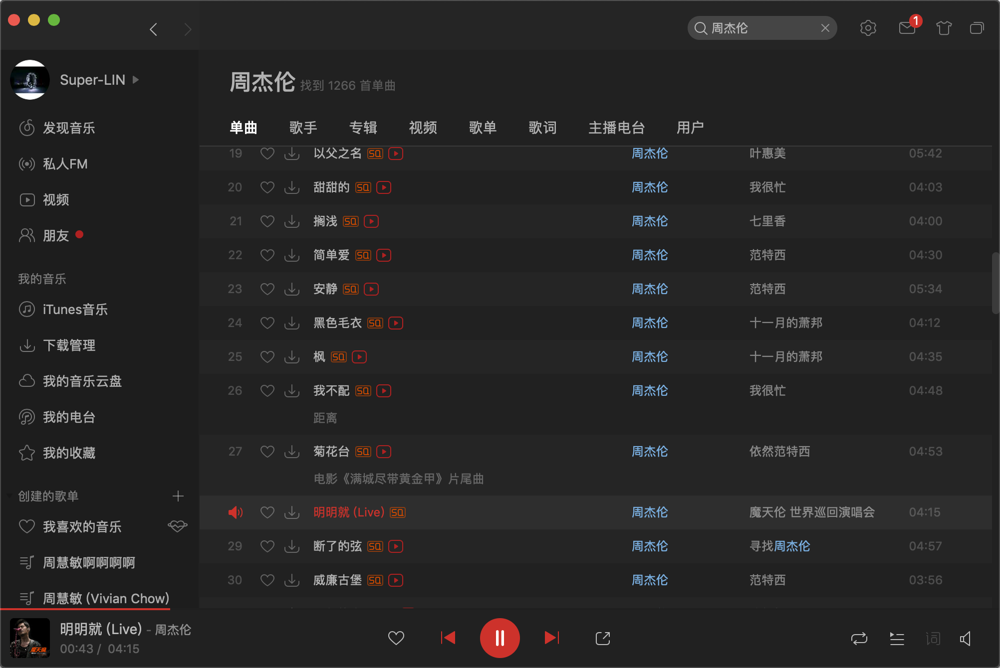
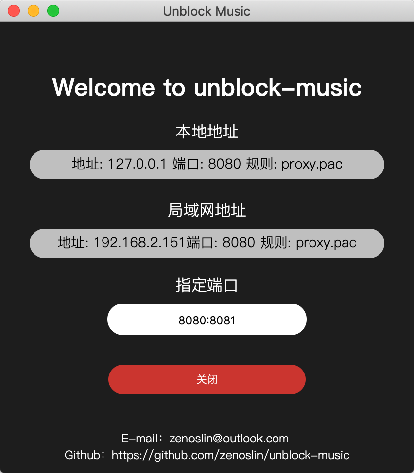
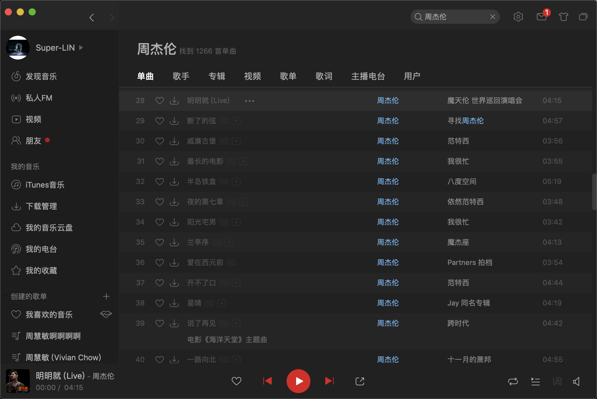
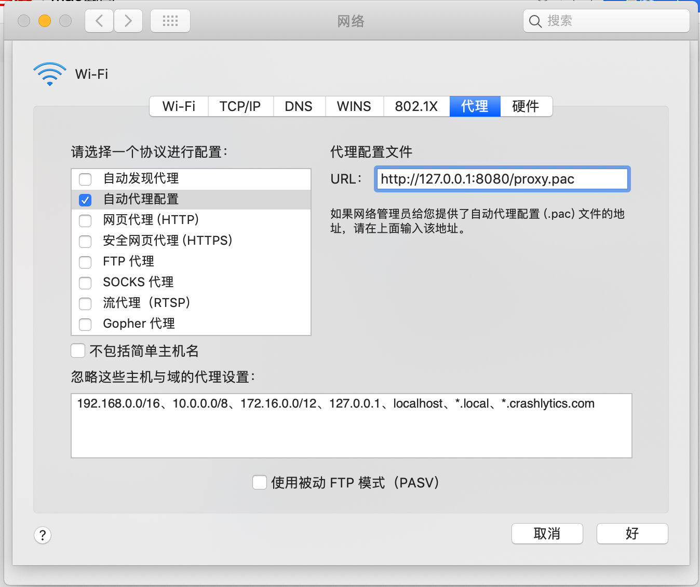
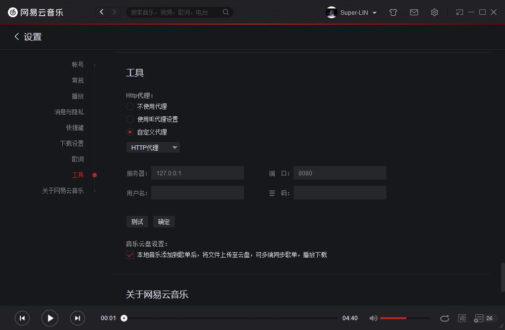

# 我在网易云听周杰伦

> 本文章仅供学习使用，切勿用于商业用途

我为什么会用网易云音乐，因为他的用户体验好呀

可是渐渐地，我的歌单中一首首歌变成了灰色

这是音乐版权的大时代，但是也是用户体验的地狱时代

我开始需要开着几个 app 轮流听歌，我的歌单也开始变得毫无作用

可能用户的诉求只是能在一张歌单里轮着听自己喜欢的歌

## 起源

那天我在 Gayhub 看到了一个神奇的仓库[UnblockNeteaseMusic](https://github.com/nondanee/UnblockNeteaseMusic)，用偷天换日的手段让变灰的歌曲解锁。

这就让我兴奋的搓搓手，很快我就使用这个脚本解锁了我的音乐之旅。



感叹这个代码库神奇的同时，我开始思考如果我换电脑听歌，我还要重新部署 node 环境，clone 代码在还是挺麻烦的呢。

那就做一个桌面应用程序吧。

## unblock-music

### 方法一：运行 node 脚本

安装 node 环境之后

```shell
// 获取代码
git clone https://github.com/nondanee/UnblockNeteaseMusic.git

cd UnblockNeteaseMusic

// 在8080端口和8081端口上执行
node app.js -p 8080:8081
```

这是时候我们已经成功的开启了我们的本地代理。

PS：如果端口被占用需修改指定端口，格式：http:https

### 方法二：获取桌面应用程序

[[Github 地址](https://github.com/zenoslin/unblock-music/)]
[[Mac 下载地址](https://github.com/zenoslin/unblock-music/releases/download/beta0.1.0/unblock-music-mas-x64.zip)]
[[Win 下载地址](https://github.com/zenoslin/unblock-music/releases/download/beta0.1.0/unblock-music-win32-x64.zip)]

下载之后，点击开启就能开启本地代理



## 设置代理

做完准备工作，那么我们就网易云，启动！



QAQ 为什么我的歌是灰色的。我们还没有设置代理呢

### mac 方法

【系统偏好设置】—【网络】—【高级】—【代理】—【自动代理配置】—填入你的本地代理文件—【好的】—【应用】



### win 方法

【网易云】—【设置】—【工具】—【HTTP 代理】—填写地址和端口号



## 开始音乐之旅

让我们重启网易云！亮了亮了，我的世界都亮了！


