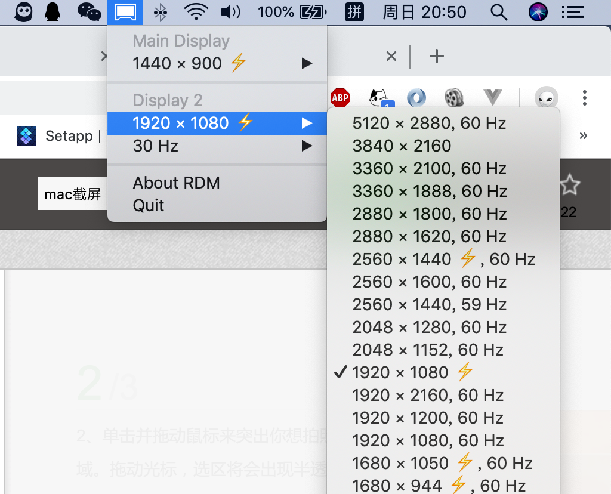

# 开启 Macbook 外接显示器的 Retina 模式

最近，在 X 东一波波折扣冲击的诱惑下，忍不住剁手了一个 4K 显示器，当我满怀惊喜地把显示器接上 Macbook 的时候。这个字也太小了 8….

macOS 并没有像 windows 放大字体大小的设置，所以只能通过修改分辨率去解决这个问题。但是这个肯定的设置中，只有 3840x2160 和 1600x900。what the fxxk！

## 分辨率调节神器 RDM

经过寻找，终于找到了一个分辨率调节的神器 RDM！

先附上下载链接[http://avi.alkalay.net/software/RDM/](http://avi.alkalay.net/software/RDM/)

这个工具可以为你的显示器设置所有分辨率



如果幸运的，想要的分辨率都带有 ⚡️ 标识，那么恭喜你你只需要选择这个分辨率就可以了。

然而，很不幸我屏幕的 1080p 和 2k 分辨率都没有 ⚡️ 标识。所以所以这个时候，所谓都文字都好像近视散光眼了一样，糊成一片。

## 开启 HiDPI

因为 macOS 和 windows 下的 DPI 机制不一样，所以这个时候我们需要去开启对应分辨率的 HiDPI。

尝试过几种不同开启 HiDPI 的方法之后，强烈推荐一下方法。

一键开启脚本[https://github.com/xzhih/one-key-hidpi](https://github.com/xzhih/one-key-hidpi)

这个东西的具体用法就不需要我说了，这个 repo 里有中文版的 readme.md 文件。

但是值得一提的是，这个脚本需要修改 system 文件夹，大多数 macbook 都是默认开启 ROOTLESS 保护机制的。

为了系统的安全性，ROOTLESS 会阻止你去操作根目录下 system、sbin、usr 这三个目录。

所以，我们需要重启电脑，按下 `Command` + `R`，进入恢复模式，然后在上面的 `实用工具` 中打开 `Terminal`。

```shell
csrutil disable
```

这个时候就可以执行脚本操作 system 文件夹下的文件了，记得在使用完毕之后，记得重新进入恢复模式开启 ROOTLESS

```shell
csrutil enable
```

## 欢迎来到 Retina 的世界

做完以上操作，你会发现你的近视散光眼好了，字变得清晰了，全世界都亮了 💡
