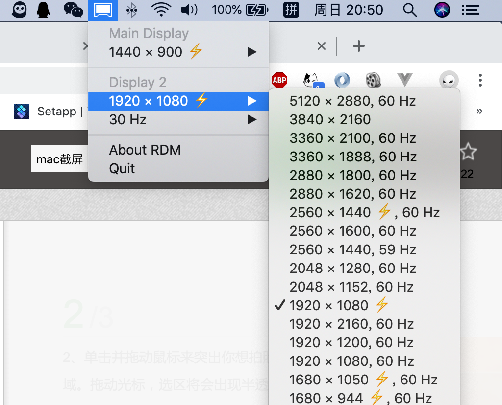

# 「周更flag」开启Macbook外接显示器的Retina模式

最近，在X东一波波折扣冲击的诱惑下，忍不住剁手了一个4K显示器，当我满怀惊喜地把显示器接上Macbook的时候。这个字也太小了8….

macOS并没有像windows放大字体大小的设置，所以只能通过修改分辨率去解决这个问题。但是这个肯定的设置中，只有3840x2160和1600x900。what the fxxk！

## 分辨率调节神器RDM

经过寻找，终于找到了一个分辨率调节的神器RDM！

先附上下载链接http://avi.alkalay.net/software/RDM/

这个工具可以为你的显示器设置所有分辨率



如果幸运的，想要的分辨率都带有⚡️标识，那么恭喜你你只需要选择这个分辨率就可以了。

然而，很不幸我屏幕的1080p和2k分辨率都没有⚡️标识。所以所以这个时候，所谓都文字都好像近视散光眼了一样，糊成一片。

## 开启 HiDPI

因为macOS和windows下的DPI机制不一样，所以这个时候我们需要去开启对应分辨率的HiDPI。

尝试过几种不同开启HiDPI的方法之后，强烈推荐一下方法。

一键开启脚本https://github.com/xzhih/one-key-hidpi

这个东西的具体用法就不需要我说了，这个repo里有中文版的readme.md文件。

但是值得一提的是，这个脚本需要修改system文件夹，大多数macbook都是默认开启ROOTLESS保护机制的。

为了系统的安全性，ROOTLESS会阻止你去操作根目录下system、sbin、usr这三个目录。

所以，我们需要重启电脑，按下 `Command` + `R`，进入恢复模式，然后在上面的 `实用工具` 中打开 `Terminal`。

``` sh
$ csrutil disable
```

这个时候就可以执行脚本操作system文件夹下的文件了，记得在使用完毕之后，记得重新进入恢复模式开启ROOTLESS

``` sh
$ csrutil enable
```

## 欢迎来到Retina的世界

做完以上操作，你会发现你的近视散光眼好了，字变得清晰了，全世界都亮了💡